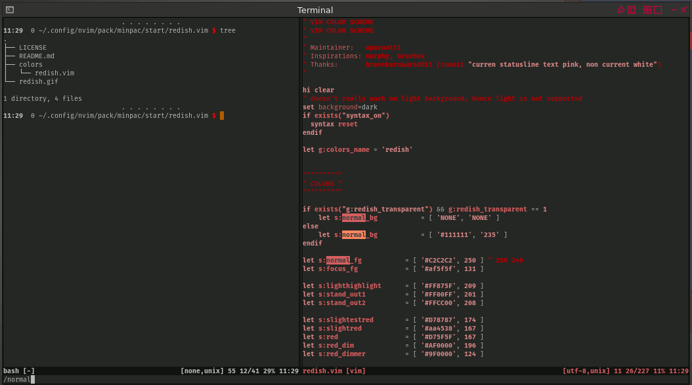

# redish.vim

A vim colorscheme using redish colors. Has been dog fooded on neovim, in 256
color terminal, but not (yet) much so on vim or a gui. If there are problems
please let me know.

When `let g:redish_transparent = 1` is set, the background color is not set to
dark grey. This is useful when one wants to use the terminal background
settings.

